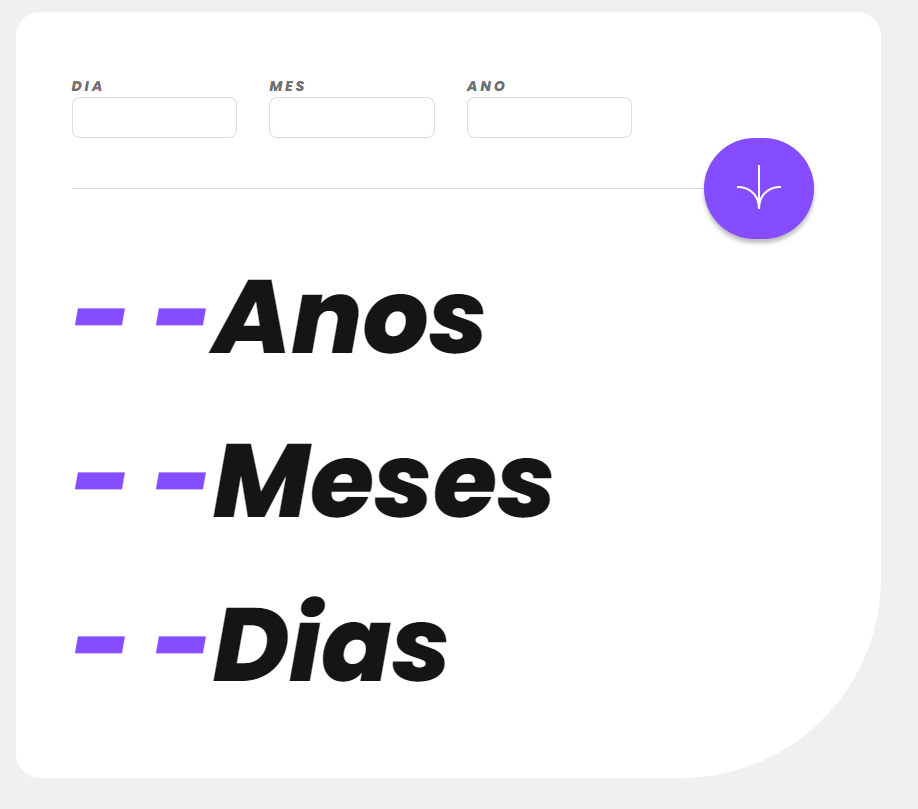
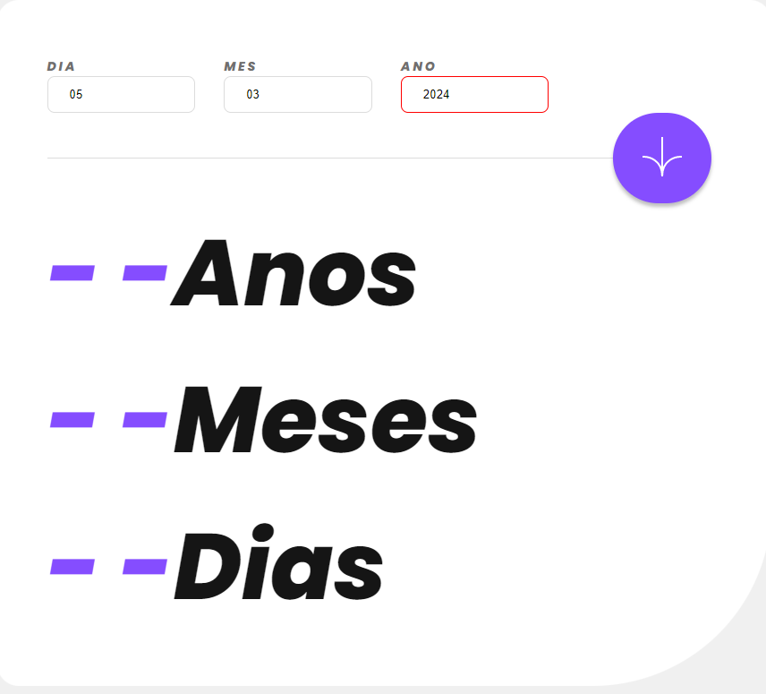

# Calculadora de Idade em dias, meses e anos.

## **Descrição**

[Aplicação web](https://calculodeidade.vercel.app) desenvolvida com a finalidade de informar ao usuário sua idade em **dias**, **meses** e **anos** de acordo com sua data de nascimento.

### O usuário deve informar:

* Dia
* Mes
* Ano

E a aplicação deve prever e criticar alguns cenários provenientes da informação digitada pelo usuário, são elas:
1. Não é permitido informar no campo **dia** valores menores que 1 e maiores que 31.
2. Não é permitido infromar no campo **mes** valores menores que 1 e maiores que 12.
3. Não é permitido informar no campo **ano** valores maiores que o ano atual.

Em caso de alguns desses cenários descritos ocorrer, ao clicar no botão para realizar o calculo, o campo que estiver fora dos padrões parametrizados deve ficar com sua borda vermelha, conforme exemplo: 

### Tecnologias utilizadas
Neste projeto foram utilizadas a seguintes tecnologias:

## Desenvolvido por :
[Luís Fernando Toledo](https://www.linkedin.com/in/luisfernandotoledo/)
